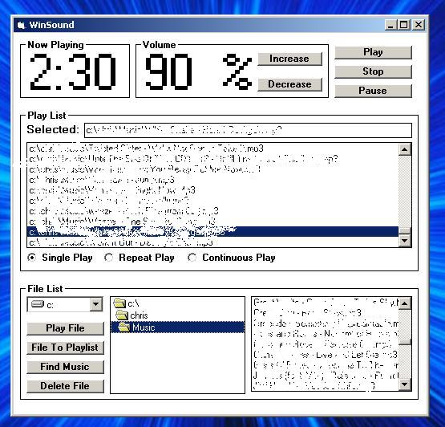



## a basic mp3 player\.

### Description

plays music files, scans the computer for sound files, has a playlist, etc.
 
### More Info
 
not commented

seems to freeze up if you try scanning an entire drive for music files, does fine at scanning folders though.

             |
---                |---
**Submitted On**   |2002-12-08 19:06:40
**By**             |[Christopher C\.](https://github.com/Planet-Source-Code/PSCIndex/blob/master/ByAuthor/christopher-c.md)
**Level**          |Beginner
**User Rating**    |4.4 (61 globes from 14 users)
**Compatibility**  |VB 4\.0 \(32\-bit\), VB 5\.0, VB 6\.0
**Category**       |[Sound/MP3](https://github.com/Planet-Source-Code/PSCIndex/blob/master/ByCategory/sound-mp3__1-45.md)
**World**          |[Visual Basic](https://github.com/Planet-Source-Code/PSCIndex/blob/master/ByWorld/visual-basic.md)
**Archive File**   |[a\_basic\_mp15101012820\.zip](https://github.com/Planet-Source-Code/christopher-c-a-basic-mp3-player__1-41304/archive/master.zip)

